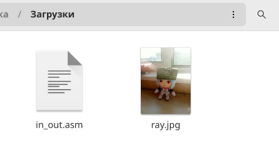

---
## Front matter
title: "Отчёт по лабороторной работе №5"
subtitle: "Основы работы с Midnight Commander (mc). Структура программы на языке ассемблера NASM."
author: "Дорохов Данила Антонович"

## Generic otions
lang: ru-RU
toc-title: "Содержание"

## Bibliography
bibliography: bib/cite.bib
csl: pandoc/csl/gost-r-7-0-5-2008-numeric.csl

## Pdf output format
toc: true # Table of contents
toc-depth: 2
lof: true # List of figures
lot: true # List of tables
fontsize: 12pt
linestretch: 1.5
papersize: a4
documentclass: scrreprt
## I18n polyglossia
polyglossia-lang:
  name: russian
  options:
	- spelling=modern
	- babelshorthands=true
polyglossia-otherlangs:
  name: english
## I18n babel
babel-lang: russian
babel-otherlangs: english
## Fonts
mainfont: PT Serif
romanfont: PT Serif
sansfont: PT Sans
monofont: PT Mono
mainfontoptions: Ligatures=TeX
romanfontoptions: Ligatures=TeX
sansfontoptions: Ligatures=TeX,Scale=MatchLowercase
monofontoptions: Scale=MatchLowercase,Scale=0.9
## Biblatex
biblatex: true
biblio-style: "gost-numeric"
biblatexoptions:
  - parentracker=true
  - backend=biber
  - hyperref=auto
  - language=auto
  - autolang=other*
  - citestyle=gost-numeric
## Pandoc-crossref LaTeX customization
figureTitle: "Рис."
tableTitle: "Таблица"
listingTitle: "Листинг"
lofTitle: "Список иллюстраций"
lotTitle: "Список таблиц"
lolTitle: "Листинги"
## Misc options
indent: true
header-includes:
  - \usepackage{indentfirst}
  - \usepackage{float} # keep figures where there are in the text
  - \floatplacement{figure}{H} # keep figures where there are in the text
---

# Цель работы

Приобретение практических навыков работы в Midnight Commander. Освоение
инструкций языка ассемблера mov и int.

# Задание

Здесь приводится описание задания в соответствии с рекомендациями
методического пособия и выданным вариантом.

# Теоретическое введение

Здесь описываются теоретические аспекты, связанные с выполнением работы.

Например, в табл. [-@tbl:std-dir] приведено краткое описание стандартных каталогов Unix.

: Описание некоторых каталогов файловой системы GNU Linux {#tbl:std-dir}

| Имя каталога | Описание каталога                                                                                                          |
|--------------|----------------------------------------------------------------------------------------------------------------------------|
| `/`          | Корневая директория, содержащая всю файловую                                                                               |
| `/bin `      | Основные системные утилиты, необходимые как в однопользовательском режиме, так и при обычной работе всем пользователям     |
| `/etc`       | Общесистемные конфигурационные файлы и файлы конфигурации установленных программ                                           |
| `/home`      | Содержит домашние директории пользователей, которые, в свою очередь, содержат персональные настройки и данные пользователя |
| `/media`     | Точки монтирования для сменных носителей                                                                                   |
| `/root`      | Домашняя директория пользователя  `root`                                                                                   |
| `/tmp`       | Временные файлы                                                                                                            |
| `/usr`       | Вторичная иерархия для данных пользователя                                                                                 |

Более подробно об Unix см. в [@gnu-doc:bash;@newham:2005:bash;@zarrelli:2017:bash;@robbins:2013:bash;@tannenbaum:arch-pc:ru;@tannenbaum:modern-os:ru].

# Выполнение лабораторной работы

Описываются проведённые действия, в качестве иллюстрации даётся ссылка на иллюстрацию (рис. [-@fig:001])

1. Открываем Midnight Commander. (Рис. 1-2)
{ #fig:001 width=70% }

{ #fig:002 width=70% }

2. Переходим в каталог ~/work/archpc. (Рис. 3)

{ #fig:003 width=70% }

3. Создаем папку lab05. (Рис. 4)

{ #fig:004 width=70% }

{ #fig:005 width=70% }

4. Создаем файл lab5-1.asm. (Рис. 6)

{ #fig:006 width=70% }

5. Открываем файл lab6-1.asm для редактирования. (Рис. 7)

{ #fig:007 width=70% }

6. Вводим текст программы, сохраняем изменения и закрываем файл. (Рис. 8)

{ #fig:008 width=70% }

7. Открываем файл lab5-1.asm для просмотра. Убеждаемся, что файл содержит
текст программы. (Рис. 9)

{ #fig:009 width=70% }

8. Оттранслируем текст программы lab5-1.asm в объектный файл. Выполним
компоновку объектного файла и запустим получившийся исполняемый
файл. (Рис. 10)

{ #fig:010 width=70% }

9. Скачаем файл in_out.asm со страницы курса в ТУИС. (Рис. 11)

{ #fig:011 width=70% }

10. Скопируем файл in_out.asm в каталог с файлом lab5-1.asm. (Рис. 12)

{ #fig:012 width=70% }

# Выводы

В ходе выполнения данной лабороторной работы я приобрел практические навыки
работы в Midnight Commander и освоил инструкции языка ассемблера mov и int.
